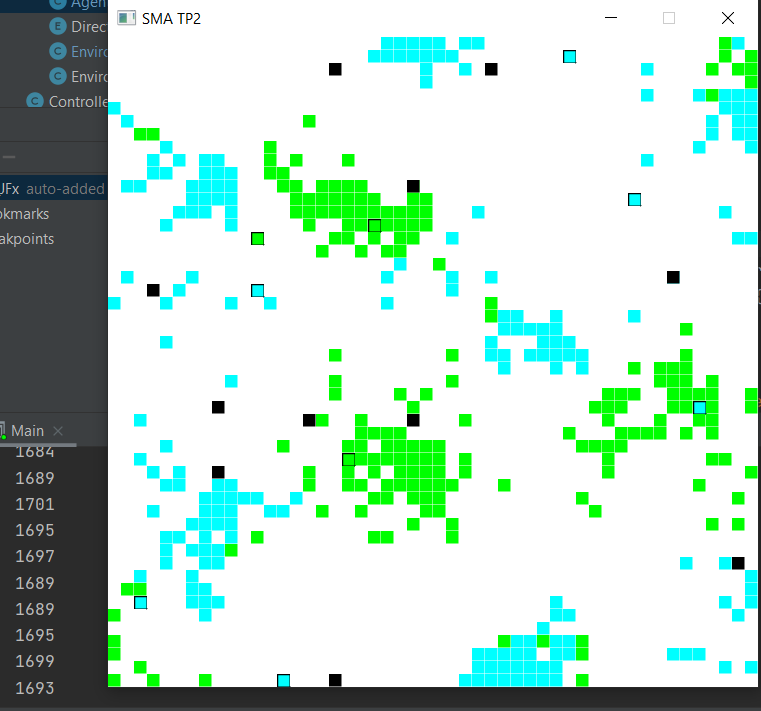
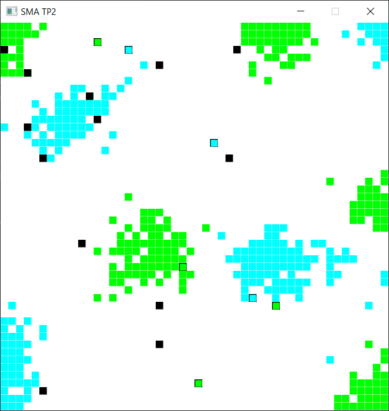
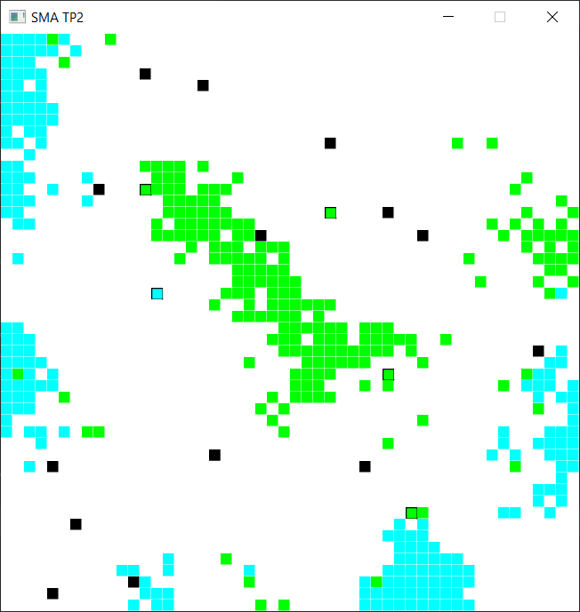

Félix Geffrault
Basile Vandervalle

# TP2 SMA

## 1ère partie

La vidéo démonstrative se trouve dans *video/Demonstration.mp4*

Dans ce TP chaque agent est implémenté comme Thread. Chaque agent se déplace aléatoirement dans 8 directions possibles (N, NE, E, SE, S, SO, O, NO) qui sont toutes répertoriés dans l'énum **Direction**.

À chaque itération les agents font une action entre *prendre*, *déposer* et se *déplacer* :
- Si un agent tient quelque chose et se trouve au-dessus d'une case vide il va alors tenter de le déposer, en cas d'échec il se déplace.
- Si un agent ne tient rien, et se trouve sur de la nourriture il va tenter de la prendre, en cas d'échec il se déplace.
- Sinon il se déplace

### Diagramme :

### Utilisation :
Pour exécuter ce projet il vous faudra JAVAFX, qu'on utilise afin de réaliser l'intégration graphique.
Une fois que la structure du projet et bien paramétré vous pouvez exécuter le code dans le fichier **src/P1/Main.java**.
Les paramètres par défaults sont:
- une grille de 50x50 (sixeX, SixeY)
- avec 20 agents (nbAgents)
- k+ = 0.1 (kPlus)
- k- = 0.3 (kMinus)
- 200 objets de types A et B (nA, nB)
- 100 000 itération (nbTurn)
- et le taux d'érreur à 0.1 (error) 

Si vous voulez changer les paramètres ci-dessus il vous suffit d'aller dans la fonction *start* de **Main**. 

On a décidé de procéder ainsi afin de perdre moins de temps entre chaque exécution et que ce soit moins répétitif.

Si vous voulez exécuter le code de la partie 1 de la version il suffit donc de mettre *error* à 0 dans le main.

Pour les significations graphiques les carrés totalement noirs sont les agents, les carrés cyans sont de la nourriture A et les carrés Vert sont de la nourriture B, et les carrés de couleurs avec un contour noir sont un agent transportant de la nourriture.

### Tests :

On a donc testé notre le programme
Afin d'avoir une meilleure perception de l'évolution du tri des agents, on print une valeur d'erreur qui est la somme cumulée du nombre de case adjacente différente à la case centrale et cela pour toutes les cases ayant un objet.
Plus le nombre est élevé, plus les différentes cases de nourriture sont éparpillées.

Cette première image montre les agents vers le début de leur tache

Cette image montre les agents vers le milieu de leur tache

On a ensuite décidé de tester nos agents avec et sans erreur de perception sur la mémoire sur 100 000 tours.

Voici l'image de fin de tâche des agents sans pourcentage erreur de perception. Notre valeur d'erreur finale à 1093.

Et la seconde image, représentant les agents avec 10% d'erreur sur la perception des objets mémorisés.

Si on compare les deux images aux visuels, on remarque que pour les agents avec une erreur de perception, certains tas comprennent un carré de la mauvaise couleur. Tandis que sans erreur de perception, on n'a pas ces soucis-là.

Si on observe maintenant notre valeur d'erreur calculer en fonction de l'environnement. Notre environnement avec les agents sans taux d'erreur a un score de 1093 tandis que ceux avec 10% d'erreur de perception de la mémoire ont une valeur de 1263.

En conclusion on remarque que les agents sont capables de travailler ensemble de façon indépendante. Même en ayant un pourcentage d'erreur de perception de 0.1 le rendu final reste acceptable.
